[[English]](README_en.md)

# Tower-Defense
- Thử nghiệm game: [https://youtu.be/EyTwTOWr5zU](https://youtu.be/EziCb7U9UbU)
- Phá đảo game: https://youtu.be/0RQHeCaz4sg
## Tài nguyên đã sử dụng
- [Tower Pack](https://foozlecc.itch.io/)
- [Tileset](https://foozlecc.itch.io/)
- [Enemy Pack](https://foozlecc.itch.io/)
- [Background Music](https://www.looperman.com/loops/detail/385402/synth-nasal-chiptune-free-90bpm-8bit-chiptune-synth-loop)
- [Logo](https://www.deviantart.com/devtrebor/art/2nd-Attempt-Made-Tower-Defense-Logo-919540652)
- [Button Sound Effect](https://pixabay.com/sound-effects/mouse-click-sound-233951/)
- [Star icon](https://pix3lcat.itch.io/star-collectibles)
- [Thud Sound Effect](https://mixkit.co/free-sound-effects/thud/)
- [Buttons Pack](https://slyfox-studios.itch.io/buttons-pack)
## Các phần mềm đã sử dụng
- [CLion](https://www.jetbrains.com/clion/): IDE C++
- [Tilemap Editor](https://www.mapeditor.org/): Tạo bản đồ cho game
- [Inno Setup](https://jrsoftware.org/isdl.php): Tạo file cài đặt game

# Giới thiệu game

**Tower Defense** là một trò chơi chiến thuật nơi bạn cần xây dựng hệ thống phòng thủ để ngăn chặn làn sóng kẻ địch xâm nhập.
Với đồ họa pixel đơn giản nhưng bắt mắt, hệ thống tháp và quái đa dạng, cùng nhiều màn chơi từ dễ đến khó, trò chơi hứa hẹn mang lại trải nghiệm hấp dẫn cho những ai yêu thích thể loại chiến thuật – thủ thành.

## Mục lục
<!-- TOC -->
* [Tower-Defense](#tower-defense)
  * [Tài nguyên đã sử dụng](#tài-nguyên-đã-sử-dụng)
  * [Các phần mềm đã sử dụng](#các-phần-mềm-đã-sử-dụng)
* [Giới thiệu game](#giới-thiệu-game)
  * [Mục lục](#mục-lục)
* [0. Cách tải game](#0-cách-tải-game)
  * [a. Cách 1: Không bao gồm code.](#a-cách-1-không-bao-gồm-code)
  * [b. Cách 2: Bao gồm code và có thể biên dịch.](#b-cách-2-bao-gồm-code-và-có-thể-biên-dịch)
* [1. Bắt đầu game](#1-bắt-đầu-game)
* [2. Chọn level](#2-chọn-level)
* [3. Giao diện trong game:](#3-giao-diện-trong-game)
* [4. Cách chơi](#4-cách-chơi)
  * [a. Tháp](#a-tháp)
  * [Các loại tháp](#các-loại-tháp)
  * [Các loại kẻ địch](#các-loại-kẻ-địch)
* [5. Chiến thắng và thất bại](#5-chiến-thắng-và-thất-bại)
* [6. Về mã nguồn game:](#6-về-mã-nguồn-game)
<!-- TOC -->

# 0. Cách tải game

## a. Cách 1: Không bao gồm code.

Tải game đã biên dịch sẵn tại link
sau: https://github.com/dominhhieu1405/Tower-Defense/releases<br/>
Cách này tiết kiệm bộ nhớ và thời gian tải đi rất nhiều (khoảng 27MB).<br/>
- File <b>TowerDefenseInstaller.exe</b> là file cài đặt game. Sau khi tải về, chỉ cần click vào file
  này và làm theo hướng dẫn để cài đặt game.<br/><br/>
- File <b>TowerDefense.zip</b> là file nén chứa game đã biên dịch sẵn. Sau khi tải về, chỉ cần giải nén ra và
  click vào file tower_defense.exe để chơi game.<br/>

## b. Cách 2: Bao gồm code và có thể biên dịch.

**Bước 1:** Clone repo này về.<br/>
Hoặc Chọn Code -> Download Zip (Khoảng 90MB)


- Tất cả code đều nằm trong thư mục src.<br/>

**Bước 2:** Cài <b>CLion</b> [Tại đây](https://www.jetbrains.com/clion/) (Hoặc các IDE hỗ trợ C++ khác) và các thành phần phụ trợ để code<br/>

Một số chú ý: <br/>
- Phải xóa xóa tất cả cc file dll của c++ trong thư mục dự án. Các file dll này chỉ dành cho người chơi không cài sẵn c++ trong máy.
- Dự án này sử dụng CMake để biên dịch, vì vậy bạn cần cài đặt CMake trong máy tính của mình. Bạn có thể tải CMake tại [đây](https://cmake.org/download/).

**Bước 3:** Nếu muốn hiện CMD thì mở file CMakeLists.txt tìm 2 dòng
```cmake    
# add_executable(tower_defense ${SOURCES} ${APP_ICON_RESOURCE_WINDOWS}) # Hiện cmd khi chạy
add_executable(tower_defense WIN32 ${SOURCES} ${APP_ICON_RESOURCE_WINDOWS}) # Không hiện cmd khi chạy
```
Bỏ dấu # ở dòng đầu tiên và thêm dấu # vào dòng thứ 2.<br/>

**Bước 4:** Build và run game: Trong CLion nhấn SHIFT+F10<br/>


# 1. Bắt đầu game

Khi mờ game sẽ thấy hiện ra giao diện

<div style="text-align: center;">

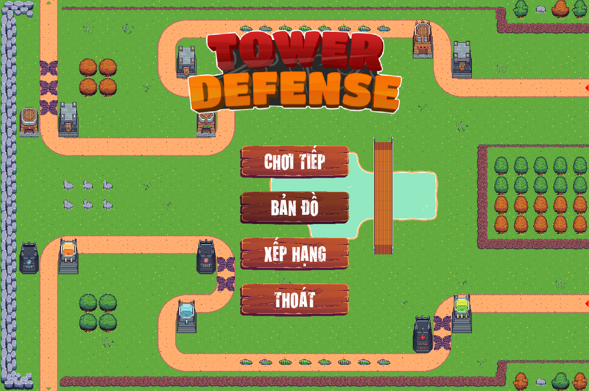

</div>

Giao diện chính của gane gồm 4 nút:
- **CHƠI TIẾP:** Bắt đầu màn cuối cùng đã chơi (Nếu có)
- **BẢN ĐỒ:** Hiển thị danh sách các level trong game
- **XẾP HẠNG:** Hiển thị bảng xếp hạng của tất cả người chơi (Đang cập nhật)
- **THOÁT:** Thoát game

# 2. Chọn level

Có tổng cộng 9 level với mức độ khó dễ khác nhau để bạn chơi. Khi di chuột lên 1 level, level đó sẽ tối màu đi. Chỉ cần
click chuột để chơi level đó.
<div style="text-align: center;">

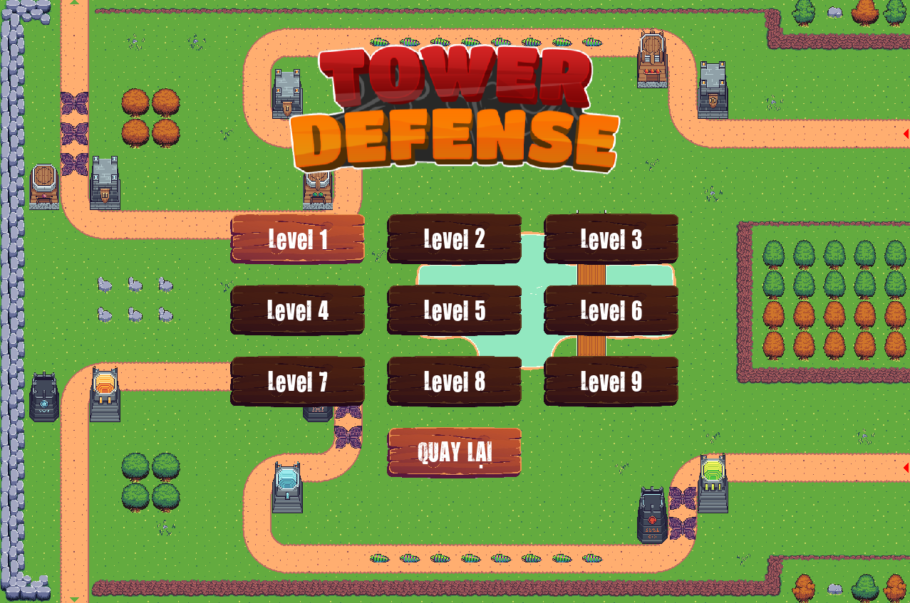
</div>

Tuy nhiên khi mới bắt đầu, bạn chỉ mở được 1 level. Chiến thắng lần lượt từng level để mở khóa và chơi level tiếp theo:
<div style="text-align: center;">

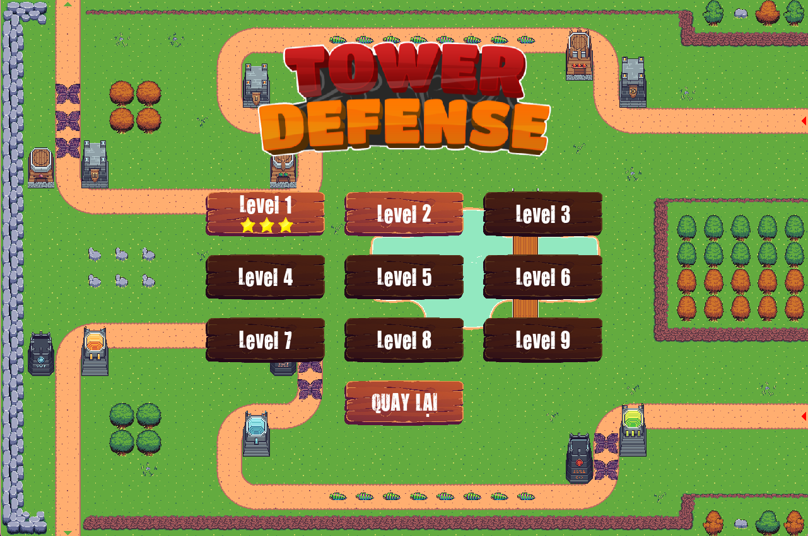
</div>

# 3. Giao diện trong game:

<div style="text-align: center;">

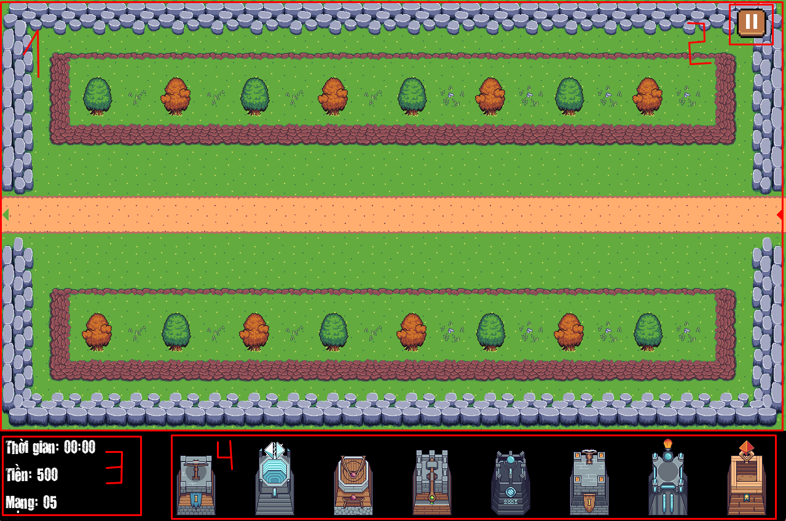
</div>

- Bản đồ (1): Là giao diện chính khi chơi, nơi bạn sẽ đặt tháp trên các bãi đất trống để tiêu diệt kẻ địch

- Nút tạm dừng (2): Là nút tạm dừng game, bạn có thể tạm dừng game khi cần làm việc khác hoặc chơi lại game hoặc quay ra màn hình chính.

- Thông tin (3): Hiển thị thời gian chơi, số tiền hiện có, số mạng còn lại.
    - Thời gian chơi: Là thời gian bạn đã chơi trong level này.
    - Số tiền hiện có: Là số tiền bạn có thể dùng để mua hoặc nâng cấp các tower.
    - Số mạng còn lại: Là số mạng bạn còn lại. Nếu số mạng này bằng 0, bạn sẽ thua game.
- Thanh chọn tháp (4): Là nơi bạn chọn tháp để đặt vào bản đồ. Bạn có thể mua tháp bằng cách kéo thả tháp vào ô cần đặt. Nếu không đủ tiền mua thì không đặt được.

# 4. Cách chơi

Đặt tháp để tiêu diệt các kẻ địch, không cho chúng đi qua ô cuối cùng (Ô có hình tam giác màu xanh).<br>

Kẻ địch sẽ xuất hiện từ ô đầu tiên (Ô có tam giác đỏ) và đi theo con đường đi đến ô cuối cùng (Ô có tam giác xanh). Nếu kẻ địch đi qua ô cuối cùng, bạn sẽ bị trừ 1 mạng)<br/>

Sau khi tiêu diệt kẻ địch, bạn sẽ nhận được số tiền tương ứng (tùy loại kẻ địch) <br/>

Bạn có thể dùng số tiền này để mua tháp hoặc nâng cấp tháp.<br/>

Bạn cũng có thể bán tháp để lấy lại tiền (Nhưng bị trừ 50% số tiền khi mua hoặc nâng cấp tháp)<br/>

Kẻ địch xuất hiện theo các vòng, có thể có nhiều vòng.<br/>

Vòng đầu tiên luôn bắt đầu vào giây thứ 15.

**Ngoài ra sẽ có âm thanh thông báo thơi gian kẻ địch xuất hiện/khi tiêu diệt kẻ địch đầu tiên**

## a. Tháp

Bạn kéo thả thap vào ô cần đặt. Nếu không đủ tiền mua hoặc kéo vào ô không hợp lệ sẽ không đặt được tháp
(Ô hợp lệ màu xanh, ô không hợp lệ màu đỏ).<br/>
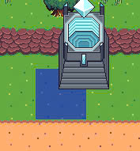
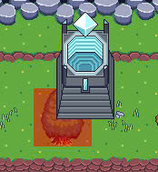

Sau khi đặt tháp sẽ hiển thị trên bản đồ.
<div style="text-align: center;">

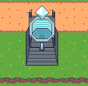
</div>
Khi bạn nhấn vào tháp, sẽ hiện ra vòng tròn màu xanh, các vị trí trong vòng tròn này là các vị trí mà tháp có thể bắn được. Tháp sẽ tự động bắn vào kẻ địch trong vòng tròn này.<br/>

Ngoài ra khi nhấn vào cũng sẽ hiện các nút: **Nâng câp** và **Bán**.<br/>
<div style="text-align: center;">

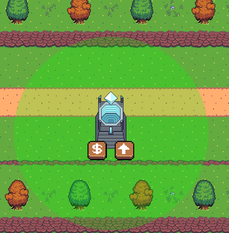
</div>

- **Nâng cấp:** Nâng cấp tháp lên cấp cao hơn. Mỗi lần nâng cấp sẽ tăng sức mạnh của tháp lên 1 bậc. Tháp có thể nâng cấp tối đa 2 lần.
- **Bán:** Bán tháp để lấy lại tiền. Bạn sẽ bị trừ 50% số tiền khi mua hoặc nâng cấp tháp.<br/>


## Các loại tháp

Có 8 loại tháp, mỗi loại tháp có 3 level. Khi mua thì tháp sẽ là level 1.

|           Ảnh           | Tên tháp      | Giá mua / nâng cấp |           Sát thương            |    Tầm đánh     |    Tốc đánh     |
|:-----------------------:|:--------------|:------------------:|:-------------------------------:|:---------------:|:---------------:|
| 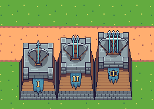 | Tháp Xạ Thủ   |  100 / 200 / 300   |          10 → 20 → 30           | 200 → 225 → 250 | 0.9 → 1.0 → 1.1 |
| 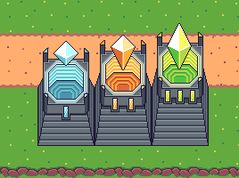 | Tháp Điện     |  100 / 200 / 300   |          10 → 20 → 30           | 200 → 225 → 250 | 0.9 → 1.0 → 1.1 |
| 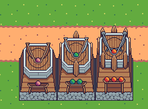 | Tháp Ná       |  100 / 200 / 300   |          10 → 20 → 30           | 200 → 225 → 250 | 0.9 → 1.0 → 1.1 |
| 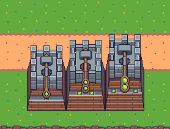 | Tháp Ném Đá   |  100 / 200 / 300   |          10 → 20 → 30           | 200 → 225 → 250 | 0.9 → 1.0 → 1.1 |
| 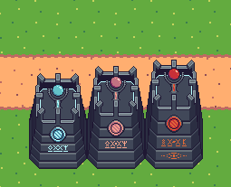 | Tháp Kính     |  100 / 200 / 300   |          10 → 20 → 30           | 200 → 225 → 250 | 0.9 → 1.0 → 1.1 |
| 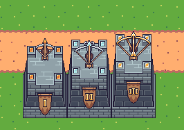 | Tháp Nỏ       |  100 / 200 / 300   |          10 → 20 → 30           | 200 → 225 → 250 | 0.9 → 1.0 → 1.1 |
| 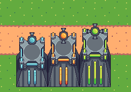 | Tháp Lửa      |  100 / 200 / 300   |          10 → 20 → 30           | 200 → 225 → 250 | 0.9 → 1.0 → 1.1 |
| 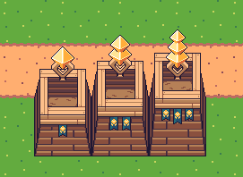 | Tháp Anh Sáng |  100 / 200 / 300   |          10 → 20 → 30           | 200 → 225 → 250 | 0.9 → 1.0 → 1.1 |

## Các loại kẻ địch

- Có 8 loại kẻ địch, mỗi loại có 3 level.

|         Ảnh         | Tên            |       Máu       |      Tốc chạy      |  Phần thưởng  |
|:-------------------:|:---------------|:---------------:|:------------------:|:-------------:|
|  | Giáp Kẹp Trùng | 120 / 180 / 240 | 0.6 → 0.75 → 0.75  | 25 → 75 → 150 |
|  | Tiểu Cường     | 150 / 225 / 300 | 0.75 → 0.75 → 0.75 | 25 → 75 → 150 |
|  | Hỏa Phong      | 130 / 195 / 260 |  0.9 → 0.9 → 0.9   | 25 → 75 → 150 |
|  | Phi Hoàng      | 120 / 180 / 240 |     1 → 1 → 1      | 25 → 75 → 150 |
|  | Diệp Trùng     | 110 / 165 / 220 |  0.5 → 0.6 → 0.6   | 25 → 75 → 150 |
|  | Nham Tước      | 160 / 240 / 320 | 0.4 → 0.55 → 0.55  | 25 → 75 → 150 |
|  | Thiết Long     | 180 / 240 / 360 | 0.6 → 0.75 → 0.75  | 25 → 75 → 150 |
|  | Hư Điệp        | 100 / 200 / 300 |  1.1 → 1.1 → 1.1   | 25 → 75 → 150 |

# 5. Chiến thắng và thất bại

- Bạn sẽ chiến thắng nếu vượt qua tất cả các vòng mà chưa hết mạng

<div style="text-align: center;">

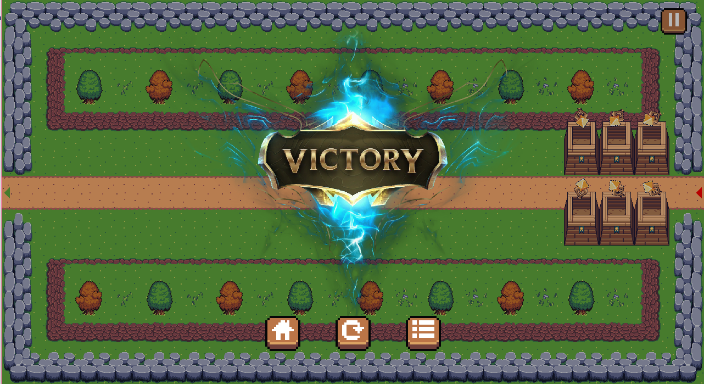
</div>

- Bạn sẽ thất bại nếu đã hết mạng

<div style="text-align: center;">

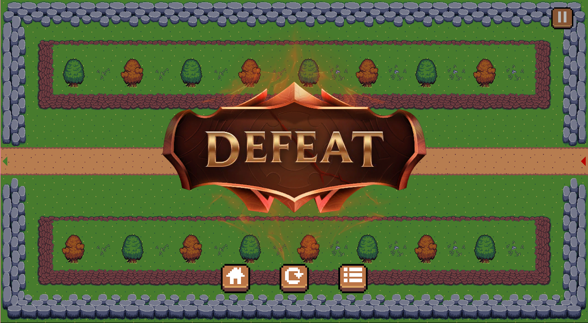
</div>

---

# 6. Về mã nguồn game:
Ngoài các file/folder được liệt kê dưới đây, các file khác đều là các file tự động sinh ra khi biên dịch game. Chúng ta không cần quan tâm đến các file này.<br/>

- Folder SDL2: Chứa các thư viện SDL2
- Folder assets: Chứa các dữ liệu game
    - Folder audios: Chứa các file âm thanh
    - Folder data: Chứa các file dữ liệu
        - Folder levels: Chứa các file dữ liệu của các level
        - data.json: Chứa các thông tin của game
        - enemies.json: Chứa các thông tin của các kẻ địch
        - levels.json: Chứa các thông tin của các level
        - towers.json: Chứa các thông tin của các tháp
    - Folder fonts: Chứa các file font chữ
    - Folder images: Chứa các file hình ảnh
        - Folder Buttons: Chứa các sheet hình ảnh của các nút
        - Folder Enemy: Chứa các sheet hình ảnh của các kẻ địch
        - Folder Tileset: Chứa các sheet hình ảnh để vẽ bản đồ
        - Folder Towers: Chứa các sheet hình ảnh của các tháp
        - Folder Weapons: Chứa các sheet hình ảnh của các vũ khí
    - Folder map-tileset: Folder dự án để tạo bản đồ bằng [Tiled](https://www.mapeditor.org/)
    - Folder maps: Chứa các file json tạo bằng [Tiled](https://www.mapeditor.org/) để vẽ bản đồ
    - File icon: Chứa icon của game
- Folder cmake-build-debug: Chứa các file được sinh ra khi biên dịch game
- Folder src: Chứa mã nguồn game
    - Enemy: Chứa struct của các kẻ địch
    - EnemyManager: Chứa class quản lý các kẻ địch
    - Game: Chứa render và xử lý sự kiện khi class chạy game
    - Leaderboard: Chứa class render và xử lý sự kiện khi quản lý bảng xếp hạng (Đang cập nhật)
    - LevelSelect: Chứa class render và xử lý sự kiện khi chọn level
    - Menu: Chứa class render và xử lý sự kiện khi menu chính
    - Play: Chứa class render và xử lý sự kiện khi chơi game
    - Struct: Chứa các struct của game
    - Tower: Chứa struct của các tháp
    - TowerManager: Chứa class quản lý các tháp
    - main.cpp: Chứa hàm main của game
    - playBullet.h: Chứa class quản lý các viên đạn khi chơi
    - playEnemy.h: Chứa class quản lý các kẻ địch khi chơi
    - playTower.h: Chứa class quản lý các tháp khi chơi
- Folder vcpkg_installed: Chứa các thư viện đã cài đặt bằng vcpkg
- File CMakeLists.txt: File cấu hình để biên dịch game
- File vcpkg.json: File cấu hình vcpkg để cài đặt các thư viện phụ trợ (json)
