[[Tiếng Việt]](README.md)

# Tower Defense
- Game Walkthrough: [https://youtu.be/1tulW5Rdnyk](https://youtu.be/1tulW5Rdnyk)

## Resources Used
- [Tower Pack](https://foozlecc.itch.io/)
- [Tileset](https://foozlecc.itch.io/)
- [Enemy Pack](https://foozlecc.itch.io/)
- [Background Music](https://www.looperman.com/loops/detail/385402/synth-nasal-chiptune-free-90bpm-8bit-chiptune-synth-loop)
- [Logo](https://www.deviantart.com/devtrebor/art/2nd-Attempt-Made-Tower-Defense-Logo-919540652)
- [Button Sound Effect](https://pixabay.com/sound-effects/mouse-click-sound-233951/)
- [Star Icon](https://pix3lcat.itch.io/star-collectibles)
- [Thud Sound Effect](https://mixkit.co/free-sound-effects/thud/)
- [Buttons Pack](https://slyfox-studios.itch.io/buttons-pack)
- [Keyboard Sound Effect](https://pixabay.com/vi/sound-effects/keyboard-click-327728/)
- [Wooden Board](https://pngtree.com/freepng/natural-wooden-board_6967761.html)

## Software Used
- [CLion](https://www.jetbrains.com/clion/): C++ IDE
- [Tilemap Editor](https://www.mapeditor.org/): Create game maps
- [Inno Setup](https://jrsoftware.org/isdl.php): Create game installer

# Game Introduction

**Tower Defense** is a strategy game where you build defense systems to stop waves of enemies from invading. With simple yet eye-catching pixel graphics, a diverse array of towers and enemies, and multiple levels ranging from easy to hard, the game promises an engaging experience for fans of tower defense strategy.

## Table of Contents
<!-- TOC -->
* [Tower Defense](#tower-defense)
  * [Resources Used](#resources-used)
  * [Software Used](#software-used)
* [Game Introduction](#game-introduction)
  * [Table of Contents](#table-of-contents)
* [0. How to Download the Game](#0-how-to-download-the-game)
  * [a. Method 1: Without Source Code](#a-method-1-without-source-code)
  * [b. Method 2: With Source Code and Buildable](#b-method-2-with-source-code-and-buildable)
* [1. Starting the Game](#1-starting-the-game)
* [2. Selecting a Level](#2-selecting-a-level)
* [3. In-Game Interface](#3-in-game-interface)
* [4. How to Play](#4-how-to-play)
  * [a. Towers](#a-towers)
  * [Types of Towers](#types-of-towers)
  * [Types of Enemies](#types-of-enemies)
* [5. Victory and Defeat](#5-victory-and-defeat)
* [6. Leaderboard](#6-leaderboard)
* [7. About the Game Source Code](#7-about-the-game-source-code)
<!-- TOC -->

# 0. How to Download the Game

## a. Method 1: Without Source Code

Download the pre-compiled game from the following link:  
https://github.com/dominhhieu1405/Tower-Defense/releases  
This method saves a lot of storage space and download time (around 27MB).
- The **TowerDefenseInstaller.exe** file is the game installer. After downloading, simply double-click this file and follow the prompts to install the game.

- The **TowerDefense.zip** file is a compressed archive of the pre-compiled game. After downloading, unzip it and double-click **tower_defense.exe** to play.

## b. Method 2: With Source Code and Buildable

**Step 1:** Clone this repository or click **Code -> Download ZIP** (around 90MB).

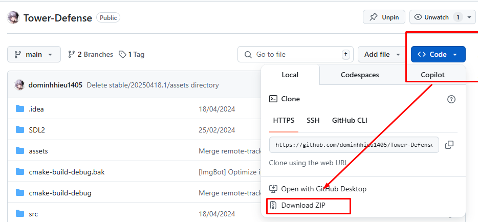

- All source code is located in the **src** directory.

**Step 2:** Install **CLion** [here](https://www.jetbrains.com/clion/) (or any other C++ IDE) and the necessary dependencies.

Notes:
- Remove all C++ DLL files in the project directory; they are only needed for players who do not have the C++ runtime installed.
- This project uses CMake for building, so install CMake from [here](https://cmake.org/download/).

**Step 3:** If you want the console window to appear, open **CMakeLists.txt** and find:
```cmake
# add_executable(tower_defense ${SOURCES} ${APP_ICON_RESOURCE_WINDOWS}) # Show console when running
add_executable(tower_defense WIN32 ${SOURCES} ${APP_ICON_RESOURCE_WINDOWS}) # Hide console when running
```
Uncomment the first line and comment out the second.

**Step 4:** Build and run the game: Press **Shift+F10** in CLion.

# 1. Starting the Game

When the game launches, you will see a name input screen.
<div style="text-align: center;">


</div>

After entering your name and pressing Enter, you will access the main menu:
<div style="text-align: center;">

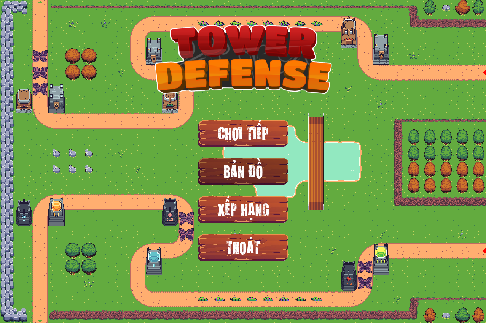

</div>

The main menu has four buttons:
- **CONTINUE:** Resume the last level played (if any)
- **MAP:** Display the list of game levels
- **LEADERBOARD:** Show the leaderboard of all players
- **EXIT:** Exit the game

# 2. Selecting a Level

There are 9 levels with varying difficulty. Hovering over a level highlights it; click to play.
<div style="text-align: center;">


</div>

At the start, only the first level is unlocked. Win levels in order to unlock the next:
<div style="text-align: center;">

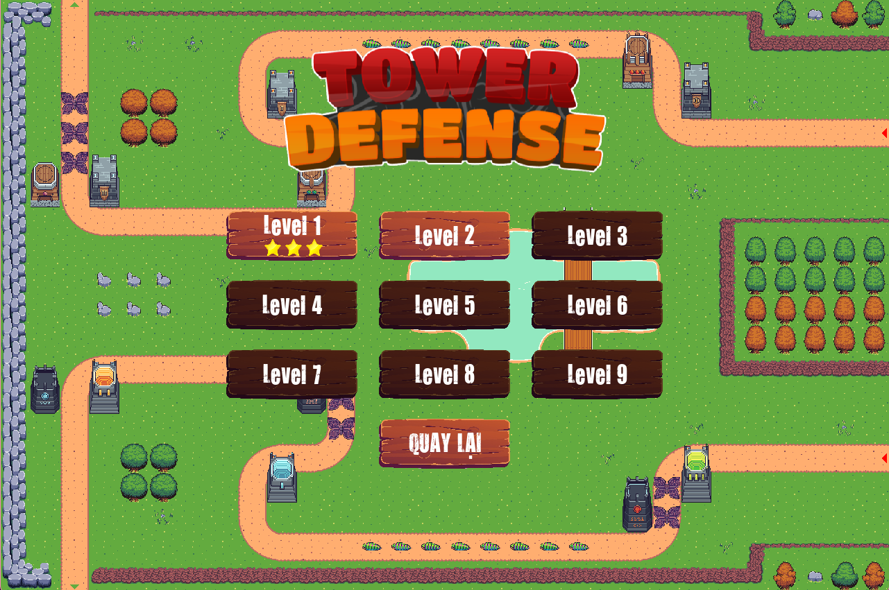
</div>

# 3. In-Game Interface

<div style="text-align: center;">


</div>

- **Map (1):** Main play area to place towers on empty tiles and destroy enemies
- **Pause Button (2):** Pause the game; you can pause to take a break, replay, or return to the main menu
- **Info Panel (3):** Shows elapsed time, current money, and remaining lives
    - **Time:** Time elapsed in the current level
    - **Money:** Currency to buy or upgrade towers
    - **Lives:** Remaining lives; reaching zero results in defeat
- **Tower Selection Bar (4):** Drag and drop towers onto valid tiles (green). Insufficient funds or invalid tiles (red) will prevent placement

# 4. How to Play

Place towers to eliminate enemies and prevent them from reaching the final tile (green triangle).

Enemies spawn from the starting tile (red triangle) and follow the path to the end tile (green triangle). If an enemy reaches the end tile, you lose one life.

Defeated enemies award money based on their type. Use this money to buy or upgrade towers. You can also sell towers for 50% of their purchase or upgrade cost.

Enemies appear in waves, which may include multiple rounds. The first wave always starts at 15 seconds.

**An alert sound plays when enemies spawn and when you defeat the first enemy.**

## a. Towers

Drag and drop a tower onto a valid tile (green). Insufficient funds or invalid tiles (red) will prevent placement.  


Once placed, the tower appears on the map.
<div style="text-align: center;">


</div>
Clicking a tower displays a green circle indicating its attack range—enemies within this circle are automatically targeted. It also shows **Upgrade** and **Sell** buttons.  
<div style="text-align: center;">

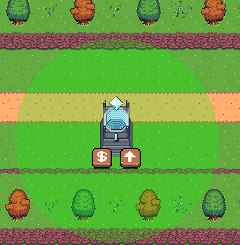
</div>

- **Upgrade:** Increase the tower's level (up to 2 upgrades), enhancing its power
- **Sell:** Remove the tower and receive 50% of its purchase/upgrade cost

## Types of Towers

There are 8 tower types, each with 3 levels. Towers are level 1 upon purchase.

|           Image           | Tower Name         | Cost (Buy / Upgrade) |        Damage         |     Range      |  Attack Speed   |
|:-------------------------:|:-------------------|:--------------------:|:---------------------:|:--------------:|:---------------:|
| 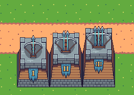   | Sniper Tower       | 100 / 200 / 300      | 10 → 20 → 30          | 200 → 225 → 250| 0.9 → 1.0 → 1.1 |
| 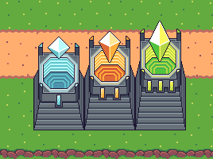   | Electric Tower     | 100 / 200 / 300      | 10 → 20 → 30          | 200 → 225 → 250| 0.9 → 1.0 → 1.1 |
| 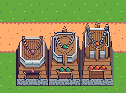   | Dart Tower         | 100 / 200 / 300      | 10 → 20 → 30          | 200 → 225 → 250| 0.9 → 1.0 → 1.1 |
| 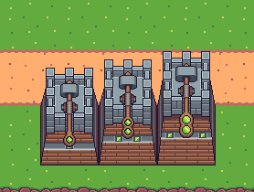   | Rock Thrower Tower | 100 / 200 / 300      | 10 → 20 → 30          | 200 → 225 → 250| 0.9 → 1.0 → 1.1 |
|    | Glass Tower        | 100 / 200 / 300      | 10 → 20 → 30          | 200 → 225 → 250| 0.9 → 1.0 → 1.1 |
| 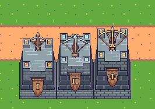   | Crossbow Tower     | 100 / 200 / 300      | 10 → 20 → 30          | 200 → 225 → 250| 0.9 → 1.0 → 1.1 |
|    | Flame Tower        | 100 / 200 / 300      | 10 → 20 → 30          | 200 → 225 → 250| 0.9 → 1.0 → 1.1 |
|    | Light Beam Tower   | 100 / 200 / 300      | 10 → 20 → 30          | 200 → 225 → 250| 0.9 → 1.0 → 1.1 |

## Types of Enemies

There are 8 enemy types, each with 3 levels.

|       Image         | Enemy Name           | Health             | Speed               | Reward         |
|:-------------------:|:---------------------|:------------------:|:-------------------:|:--------------:|
|  | Armored Beetle       | 120 / 180 / 240    | 0.6 → 0.75 → 0.75   | 25 → 75 → 150  |
| 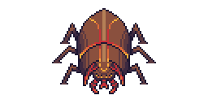 | Lesser Crusher       | 150 / 225 / 300    | 0.75 → 0.75 → 0.75  | 25 → 75 → 150  |
|  | Firestorm            | 130 / 195 / 260    | 0.9 → 0.9 → 0.9     | 25 → 75 → 150  |
| 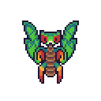 | Swift Flyer          | 120 / 180 / 240    | 1 → 1 → 1           | 25 → 75 → 150  |
|  | Leaf Crawler         | 110 / 165 / 220    | 0.5 → 0.6 → 0.6     | 25 → 75 → 150  |
| 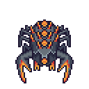 | Magma Raptor         | 160 / 240 / 320    | 0.4 → 0.55 → 0.55   | 25 → 75 → 150  |
|  | Iron Dragon          | 180 / 240 / 360    | 0.6 → 0.75 → 0.75   | 25 → 75 → 150  |
| 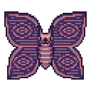 | Phantom Moth         | 100 / 200 / 300    | 1.1 → 1.1 → 1.1     | 25 → 75 → 150  |

# 5. Victory and Defeat

- You win if you complete all waves without running out of lives.
<div style="text-align: center;">


</div>

- You lose if your lives reach zero.
<div style="text-align: center;">

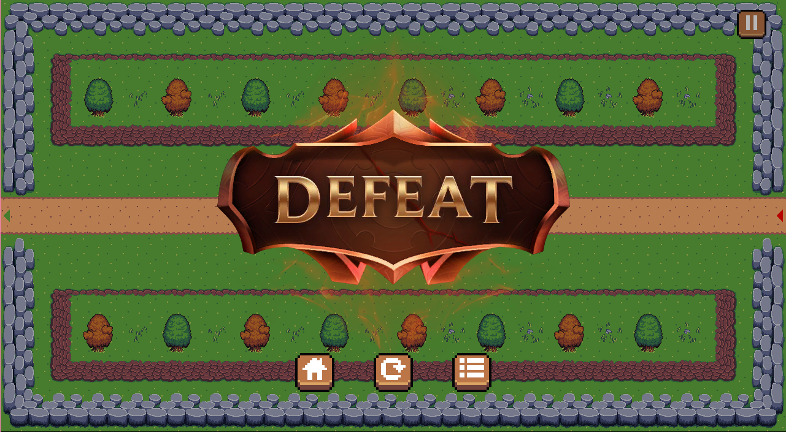
</div>

# 6. Leaderboard

- To enhance competition, the game includes a leaderboard feature with real-time updates synchronized across all players.
- Rankings are determined by highest level achieved → most remaining lives → shortest completion time.


---

# 7. About the Game Source Code

Apart from the files/folders listed below, all other files are auto-generated during compilation and do not require attention.

- **SDL2** folder: Contains SDL2 libraries.
- **assets** folder: Contains game data.
    - **audios**: Audio files.
    - **data**: Data files.
        - **levels**: Level data files.
        - **data.json**: Game information.
        - **enemies.json**: Enemy information.
        - **levels.json**: Level information.
        - **towers.json**: Tower information.
    - **fonts**: Font files.
    - **images**: Image files.
        - **Buttons**: Button spritesheets.
        - **Enemy**: Enemy spritesheets.
        - **Tileset**: Tileset spritesheets for map rendering.
        - **Towers**: Tower spritesheets.
        - **Weapons**: Weapon spritesheets.
    - **map-tileset**: Tiled project for creating maps.
    - **maps**: JSON map files created by Tiled.
    - **icon**: Game icon file.
- **cmake-build-debug** folder: Compilation output files.
- **src** folder: Game source code.
    - **Enemy**: Enemy structs.
    - **EnemyManager**: Enemy management class.
    - **Game**: Rendering and event handling class.
    - **Leaderboard**: Leaderboard rendering and event handling class.
    - **LevelSelect**: Level selection rendering and event handling class.
    - **Menu**: Main menu rendering and event handling class.
    - **Play**: Gameplay rendering and event handling class.
    - **Struct**: Game data structs.
    - **Tower**: Tower structs.
    - **TowerManager**: Tower management class.
    - **main.cpp**: Main function.
    - **playBullet.h**: Bullet management class.
    - **playEnemy.h**: Enemy management class.
    - **playTower.h**: Tower management class.
- **vcpkg_installed** folder: Libraries installed by vcpkg.
- **CMakeLists.txt**: Build configuration file.
- **vcpkg.json**: vcpkg configuration file for dependencies.

