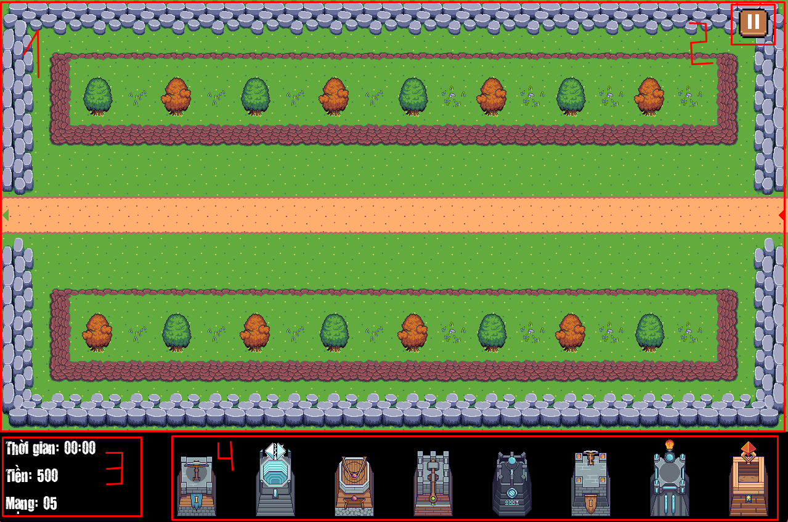
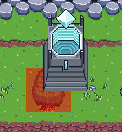
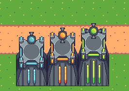

[Tiếng Việt](README.md)

# Tower-Defense
- Game demo: [https://youtu.be/EyTwTOWr5zU](https://youtu.be/EziCb7U9UbU)
- Game beaten: https://youtu.be/0RQHeCaz4sg
## Resources Used
- [Tower Pack](https://foozlecc.itch.io/)
- [Tileset](https://foozlecc.itch.io/)
- [Enemy Pack](https://foozlecc.itch.io/)
- [Background Music](https://www.looperman.com/loops/detail/385402/synth-nasal-chiptune-free-90bpm-8bit-chiptune-synth-loop)
- [Logo](https://www.deviantart.com/devtrebor/art/2nd-Attempt-Made-Tower-Defense-Logo-919540652)
- [Button Sound Effect](https://pixabay.com/sound-effects/mouse-click-sound-233951/)
- [Star icon](https://pix3lcat.itch.io/star-collectibles)
- [Thud Sound Effect](https://mixkit.co/free-sound-effects/thud/)
- [Buttons Pack](https://slyfox-studios.itch.io/buttons-pack)
## Software Used
- [CLion](https://www.jetbrains.com/clion/): C++ IDE
- [Tilemap Editor](https://www.mapeditor.org/): Create game maps
- [Inno Setup](https://jrsoftware.org/isdl.php): Create game installer

# Game Introduction

**Tower Defense** is a strategy game where you need to build a defense system to stop waves of invading enemies.
With simple but eye-catching pixel graphics, a variety of towers and enemies, and many levels from easy to hard, the game promises to deliver an exciting experience for strategy and tower defense enthusiasts.

## Table of Contents
<!-- TOC -->
* [Tower-Defense](#tower-defense)
  * [Resources Used](#resources-used)
  * [Software Used](#software-used)
* [Game Introduction](#game-introduction)
  * [Table of Contents](#table-of-contents)
* [0. How to Download the Game](#0-how-to-download-the-game)
  * [a. Method 1: Without Code](#a-method-1-without-code)
  * [b. Method 2: With Code and Compilable](#b-method-2-with-code-and-compilable)
* [1. Start the Game](#1-start-the-game)
* [2. Select Level](#2-select-level)
* [3. In-Game Interface](#3-in-game-interface)
* [4. How to Play](#4-how-to-play)
  * [a. Towers](#a-towers)
  * [Tower Types](#tower-types)
  * [Enemy Types](#enemy-types)
* [5. Victory and Defeat](#5-victory-and-defeat)
* [6. About the Game Source Code](#6-about-the-game-source-code)
<!-- TOC -->

# 0. How to Download the Game

## a. Method 1: Without Code

Download the compiled game at the following link:
https://github.com/dominhhieu1405/Tower-Defense/releases<br/>
This method saves a lot of storage and download time (around 27MB).<br/>
- The **TowerDefenseInstaller.exe** file is the game installer. After downloading, just click this file and follow the instructions to install the game.<br/><br/>
- The **TowerDefense.zip** file is a compressed archive containing the compiled game. After downloading, just extract it and click the **tower_defense.exe** file to play the game.<br/>

## b. Method 2: With Code and Compilable

**Step 1:** Clone this repo.<br/>
Or choose **Code -> Download ZIP** (Approximately 90MB)


- All code is located in the **src** folder.<br/>

**Step 2:** Install **CLion** [Here](https://www.jetbrains.com/clion/) (or other C++-supporting IDEs) and the necessary tools for building the code<br/>

Some notes:<br/>
- You must delete all C++ DLL files in the project folder. These DLL files are only for players who do not have C++ installed on their machines.
- This project uses CMake for building, so you need to have CMake installed on your computer. You can download CMake [here](https://cmake.org/download/).

**Step 3:** If you want to show the console window, open the **CMakeLists.txt** file and find these two lines:
```cmake
# add_executable(tower_defense ${SOURCES} ${APP_ICON_RESOURCE_WINDOWS}) # Show console when running
add_executable(tower_defense WIN32 ${SOURCES} ${APP_ICON_RESOURCE_WINDOWS}) # Hide console when running
```
Uncomment the first line and comment out the second line.<br/>

**Step 4:** Build and run the game: In CLion, press **SHIFT+F10**<br/>


# 1. Start the Game

When the game launches, the main interface will appear

<div style="text-align: center;">


</div>

The main interface of the game consists of 4 buttons:
- **CONTINUE:** Start from the last level played (if any)
- **MAP:** Display the list of levels in the game
- **LEADERBOARD:** Display the leaderboard of all players (Updating)
- **EXIT:** Exit the game

# 2. Select Level

There are a total of 9 levels with varying difficulties for you to play. When you hover over a level, it will darken. Just click to play that level.
<div style="text-align: center;">


</div>

However, when you first start, only the first level is unlocked. Win each level in sequence to unlock and play the next level:
<div style="text-align: center;">


</div>

# 3. In-Game Interface

<div style="text-align: center;">


</div>

- **Map (1):** The main gameplay area where you place towers on empty tiles to defeat enemies.

- **Pause Button (2):** Pause the game. You can pause to do other tasks, retry the level, or return to the main menu.

- **Info (3):** Displays elapsed time, current money, and remaining lives.
    - **Elapsed Time:** How long you have played in this level.
    - **Current Money:** The money you can use to buy or upgrade towers.
    - **Remaining Lives:** If this reaches 0, you lose the game.
- **Tower Selection Bar (4):** Where you select towers to place on the map. You can buy a tower by dragging and dropping it onto a valid tile. If you don't have enough money, you cannot place it.

# 4. How to Play

Place towers to defeat enemies, preventing them from reaching the final tile (the tile with a green triangle).<br/>

Enemies spawn at the first tile (the tile with a red triangle) and follow the path to the final tile (the tile with a green triangle). If an enemy reaches the final tile, you lose 1 life.<br/>

After defeating enemies, you will receive money based on the enemy type.<br/>

You can use this money to buy or upgrade towers.<br/>

You can also sell towers to get money back (but you lose 50% of the purchase or upgrade cost).<br/>

Enemies appear in waves; there can be multiple waves.<br/>

The first wave always starts at the 15-second mark.

**There is also a sound notification for when the next wave starts and when the first enemy is defeated.**

## a. Towers

Drag and drop a tower onto a valid tile. If you do not have enough money or drop it on an invalid tile, you cannot place the tower (valid tile turns green, invalid tile turns red).<br/>



After placing a tower, it appears on the map.
<div style="text-align: center;">


</div>
When you click a tower, a green circle appears, indicating its attack range. The tower will automatically shoot at enemies within this circle.<br/>

Additionally, **Upgrade** and **Sell** buttons appear when you click:
<div style="text-align: center;">


</div>

- **Upgrade:** Upgrade the tower to the next level, increasing its power by one tier. Towers can be upgraded up to 2 times.
- **Sell:** Sell the tower to get money back. You lose 50% of the money spent on purchasing or upgrading.


## Tower Types

There are 8 types of towers, each with 3 levels. Towers start at level 1 when purchased.

|          Image          | Tower Name     | Cost / Upgrade Cost |    Damage    |      Range      |  Attack Speed   |
|:-----------------------:|:---------------|:-------------------:|:------------:|:---------------:|:---------------:|
|  | Sniper Tower   |   100 / 200 / 300   | 10 → 20 → 30 | 200 → 225 → 250 | 0.9 → 1.0 → 1.1 |
|  | Tesla Tower    |   100 / 200 / 300   | 10 → 20 → 30 | 200 → 225 → 250 | 0.9 → 1.0 → 1.1 |
|  | Dart Tower     |   100 / 200 / 300   | 10 → 20 → 30 | 200 → 225 → 250 | 0.9 → 1.0 → 1.1 |
|  | Rock Thrower   |   100 / 200 / 300   | 10 → 20 → 30 | 200 → 225 → 250 | 0.9 → 1.0 → 1.1 |
|  | Frost Tower    |   100 / 200 / 300   | 10 → 20 → 30 | 200 → 225 → 250 | 0.9 → 1.0 → 1.1 |
|  | Crossbow Tower |   100 / 200 / 300   | 10 → 20 → 30 | 200 → 225 → 250 | 0.9 → 1.0 → 1.1 |
|  | Flame Tower    |   100 / 200 / 300   | 10 → 20 → 30 | 200 → 225 → 250 | 0.9 → 1.0 → 1.1 |
|  | Light Tower    |   100 / 200 / 300   | 10 → 20 → 30 | 200 → 225 → 250 | 0.9 → 1.0 → 1.1 |

## Enemy Types

There are 8 types of enemies, each with 3 levels.

|        Image        | Name           | Health          | Speed              |    Reward     |
|:-------------------:|:---------------|:----------------|:-------------------|:-------------:|
|  | Armored Beetle | 120 / 180 / 240 | 0.6 → 0.75 → 0.75  | 25 → 75 → 150 |
|  | Mini Brute     | 150 / 225 / 300 | 0.75 → 0.75 → 0.75 | 25 → 75 → 150 |
|  | Firestorm      | 130 / 195 / 260 | 0.9 → 0.9 → 0.9    | 25 → 75 → 150 |
|  | Sky Phoenix    | 120 / 180 / 240 | 1 → 1 → 1          | 25 → 75 → 150 |
|  | Leaf Crawler   | 110 / 165 / 220 | 0.5 → 0.6 → 0.6    | 25 → 75 → 150 |
|  | Magma Wasp     | 160 / 240 / 320 | 0.4 → 0.55 → 0.55  | 25 → 75 → 150 |
|  | Iron Dragon    | 180 / 240 / 360 | 0.6 → 0.75 → 0.75  | 25 → 75 → 150 |
|  | Phantom Moth   | 100 / 200 / 300 | 1.1 → 1.1 → 1.1    | 25 → 75 → 150 |

# 5. Victory and Defeat

- You win if you survive all waves without running out of lives.

<div style="text-align: center;">


</div>

- You lose if you run out of lives.

<div style="text-align: center;">


</div>

---

# 6. About the Game Source Code

Aside from the files/folders listed below, all other files are auto-generated during the build and can be ignored.<br/>

- **SDL2 Folder:** Contains SDL2 libraries
- **assets Folder:** Contains game data
    - **audios Folder:** Contains audio files
    - **data Folder:** Contains data files
        - **levels Folder:** Contains level data files
        - **data.json:** Contains game information
        - **enemies.json:** Contains enemy information
        - **levels.json:** Contains level information
        - **towers.json:** Contains tower information
    - **fonts Folder:** Contains font files
    - **images Folder:** Contains image files
        - **Buttons Folder:** Contains button spritesheets
        - **Enemy Folder:** Contains enemy spritesheets
        - **Tileset Folder:** Contains map tileset spritesheets
        - **Towers Folder:** Contains tower spritesheets
        - **Weapons Folder:** Contains weapon spritesheets
    - **map-tileset Folder:** Project folder for creating maps with [Tiled](https://www.mapeditor.org/)
    - **maps Folder:** Contains JSON files generated by [Tiled](https://www.mapeditor.org/) for drawing maps
    - **icon File:** Contains the game icon
- **cmake-build-debug Folder:** Contains files generated during compilation
- **src Folder:** Contains game source code
    - **Enemy:** Contains enemy structs
    - **EnemyManager:** Contains the enemy management class
    - **Game:** Contains the rendering and event handling class for running the game
    - **Leaderboard:** Contains the rendering and event handling class for the leaderboard (Updating)
    - **LevelSelect:** Contains the rendering and event handling class for level selection
    - **Menu:** Contains the rendering and event handling class for the main menu
    - **Play:** Contains the rendering and event handling class for gameplay
    - **Struct:** Contains game structs
    - **Tower:** Contains tower structs
    - **TowerManager:** Contains the tower management class
    - **main.cpp:** Contains the main function of the game
    - **playBullet.h:** Contains the class managing bullets during gameplay
    - **playEnemy.h:** Contains the class managing enemies during gameplay
    - **playTower.h:** Contains the class managing towers during gameplay
- **vcpkg_installed Folder:** Contains libraries installed via vcpkg
- **CMakeLists.txt:** The build configuration file
- **vcpkg.json:** The vcpkg configuration file for auxiliary libraries (json)

